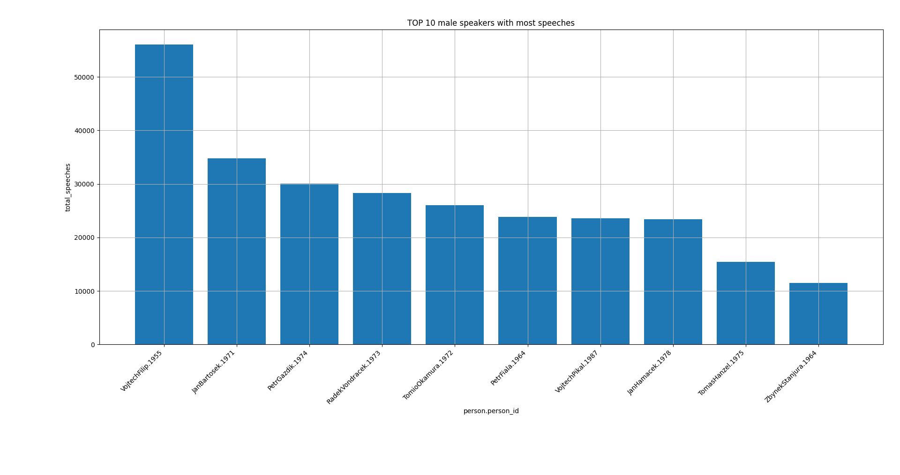

# ParlaStats - Final Report

## Contents
- Goal of the project
- Future of the project
- Examples
- Useful links

## Goal of the project
- The goal of the project was to create a system for extraction of information from the ParlaMint and ParCzech corpora and storing them efficiently, allowing users to run queries on them.
- From these corpora, multiple properties of individual speakers can be observed (average words per speech, average length of speech, ...)
- The system should be able to extract the metadata about individual speakers (names, speeches, affiliations) and organisations (names, roles).
- System should provide an API for querying the data extracted from the corpora, which will be stored in a PostgreSQL database.
- It would be quite hard for a non-technical user to query the SQL database as they typically do not know the implementation details of the database, so a simpler way of querying should be designed and implemented into the API as well.

## Future of the project
- The application, as it is now, is a console application with all servers running locally, all data stored locally.
- Further improvements, among other, could target this particular aspect.
- To be precise, the final goal is to create an application, which would allow users to conduct some statistical research upon the ParlaMint and ParCzech corpora, ideally in the form of web application.
- The big advantage of the ParaLint corpora is, that it has strictly defined format, and the corpra are available for many european languages allowing even cross-language statistic research and analysis.
- The goal of the first part of the project (current state) was to design and implement a backend for such web application.
- Additionaly, ParCzech corpus contains audio recordings of the speeches as well, which could bring many more interesting statistical insights, and which are not extracted by the application yet.
- **So all-in-all improvement I would like to do:**
    - Design and implement convenient GUI for better and more enjoyable user experience.
    - Create a frontend of the web application and link it to the backend.
    - Run the server scripts on some actual server, not locally.
    - Provide more means of visualization of the retrieved data (graphs / charts other than bar chart)
    - Include the processing of audio as well, where it is present and possible.

## Examples:
- *How many tokens has average speech for each gender?*
    ```
    +---------------------+------------+
    |    average_tokens   | person.sex |
    +---------------------+------------+
    | 84.0855333685910722 |     M      |
    | 35.2678488704064813 |     F      |
    +---------------------+------------+
    ```
    `M` - male
    `F` - female
    Data extracted from Latvian ParlaMint corpus.
- *How many speeches were given by members of each political party?*
    ```
    +---------------------------------------------------------------+----------------+
    |                       organisation.name                       | total_speeches |
    +---------------------------------------------------------------+----------------+
    |                    Poslanecký klub ANO 2011                   |     108813     |
    |             Poslanecký klub České pirátské strany             |     45663      |
    |       Poslanecký klub České strany sociálně demokratické      |     98991      |
    |                    Poslanecký klub KDU-ČSL                    |     48168      |
    |       Poslanecký klub Komunistické strany Čech a Moravy       |     82236      |
    |          Poslanecký klub Občanské demokratické strany         |     79395      |
    |             Poslanecký klub Starostové a nezávislí            |     12588      |
    |           Poslanecký klub Svoboda a přímá demokracie          |     29382      |
    |                     Poslanecký klub TOP 09                    |     11862      |
    |              Poslanecký klub TOP 09 a Starostové              |     56895      |
    |            Poslanecký klub Úsvit - Národní Koalice            |      8268      |
    |                            ANO2011                            |     15711      |
    |                     Česká pirátská strana                     |     39651      |
    |               Česká strana sociálně demokratická              |     68667      |
    |               Komunistická strana Čech a Moravy               |     76815      |
    | Křesťanská a demokratická unie - Československá strana lidová |     42672      |
    |                  Občanská demokratická strana                 |     59469      |
    |                     Starostove a nezavisli                    |      4356      |
    |           Svoboda a prima demokracie - Tomio Okamura          |      3483      |
    |                             TOP 09                            |     55395      |
    |              Úsvit přímé demokracie Tomia Okamury             |      7578      |
    +---------------------------------------------------------------+----------------+
    ```
    Data obtained from the ParCzech corpus.
- *Top 10 most talkative male speakers (most speeches given)*
    
    Data obtained from the ParCzech corpus.

## Useful links
- <a href="https://github.com/ufal/ParlaStats/blob/main/documentation/UserDoc.md">User documentation</a>
- <a href="https://github.com/ufal/ParlaStats/blob/main/documentation/ProgDoc.md">Programming documentation</a>
- <a href="https://docs.google.com/presentation/d/1iC10ApcHOpYDNF5lVimfAfqSLyK901buIJ31bld3h8M/edit?usp=drive_link">ParlaStats presentation</a>