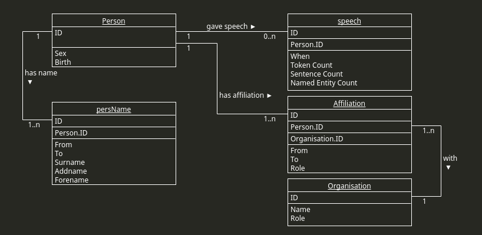

# ParlaStats - Programmer Documentation

## Contents
- **Metadata Extraction**
    - orgParser
        - PoliticalOrientation
        - Organization
        - organizationParser
    - personParser
        - Affiliation
        - PersonName
        - Person
        - personParser
    - speechParser
        - Document
        - Speech
        - speechParser
- **Database implementation and communication**
    - commands
    - create_database
    - DatabaseOperator
    - DatabaseTableCreator
    - DatabaseInserter
    - DatabaseQuerrier
    - MainDriver
- **Api**
    - Client
    - Server
- **Used external tools**
    - Database tools
    - Python libraries
## 1. Metadata Extraction
### 1.1 Organization parser (orgParser.py)
- This file contains 3 classes (`PoliticalOrientation`, `Organization`, `organizationParser`)
- `PoliticalOrientation` and `Organization` are used to store the metadata about political organizations extracted by `organizationParser`
- #### 1.1.1 PoliticalOrientation
    - `PoliticalOrientation(orientation : str)`
    - Class for storing the information about political orientation record of some political organization.
    - Contains short description of political orientation
    - **Attributes**:
        - `orientation` - Short description of the political orientation (`string`)
    - **Methods**:
        - `__str__()`
            - Modified conversion of the class to string for debugging purposes.
- #### 1.1.2 Organization
    - `Organization(ID : str, role : str)`
    - Class for storing the information about political organization.
    - Contains the information about name of the political party, xml:id (from .xml source) for the reference and the role of political organization.
    - **Attributes:**
        - `name` - List of name records of the organization in english and native language + abbreviation (`dict(str:str)`)
        - `ID` - ID of the organization (`string`)
        - `role` - Role of the organization within parliament (`string`)
        - `orientation_records` - List of political orientation records (`[PoliticalOrientation]`)
    - **Methods**:
        - `__str__()`
            - Modified conversion of the class to string for debugging purposes.
- #### 1.1.3 organizationParser
    - `organizationParser(source : str, country_code : str)`
    - A class responsible for extracting the organization metadata from corpus xml files.
    - **Attributes**:
        - `source` - a path to the xml file which is to be parsed (`string`)
        - `country_code` - a code of the country from the source `xml` file (`string`)
        - `organizations` - Dictionary for storing the extracted organizations.
            - `dict(ID:(Organization, country_code))`
        - `parser` - a `xml` file parser (`lxml.etree.XMLParser`)
    - **Methods:**
        - **`__extractNameRecords(organization)`**
            - A helper method for extracting the name record(s) of a given organization
            - Name si extracted in both native and english if present, and an abbreviation is extracted as well if present.
            - *parameters*:
                - `organization` - an 'org' xml element of the ParlaMint format.
            - *returns*:
                - A dictionary containing the name record(s) with the information about the language the name is written in or an abbreviation.
                - `dict(str:str)`
        - **`__extractOrientationRecords(organization)`**
            - A helper method for extracting information on political orientation.
            - If the information is present extracts it, if not warns about its absence.
            - *parameters*
                - `organization` - an xml element of ParlaMint format.
            - *returns*
                - `orientation_records` - a list of `PoliticalOrientation` records.
        - **`extractMetadata()`**
            - A method for extracting the metadata about organizations from `.xml`files.
            - Reads all instances of the `orgName` tag and stores extracted information into `Organization.name` dictionary in a following way:
                - if `orgName.full` is `yes`  then key-value pair (`nameLang`, `name`) is stored
                - if `orgName.full` is `abb` then key-value pair (`"abb"`, `name`) is stored
            - Political orientation records are extracted in following way:
                - Try to find the `state` tag within the `org` tag which has type `politicalOrientation`
                - If found try to find the `ana` attribute.
                - If found, store it as `PoliticalOrientation` record into the `Organization.orientation_records` list
            - Uses the `xml.dom.minidom` to parse the `xml` file (path in `source` attribute) and represent it using a tree data structure.
            - Then finds all `org` tags within the `xml` file and iterates over them, calling the `__extractNameRecords()` and `__extractOrientationRecords()` for each `org` tag and stores the output of these helper methods into the `Organization` object appropriately.
            - *returns*
                - `organizations` - `orgParser`s' own attribute. 

### 1.2 Person parser(personParser.py) 
- This file contains 4 classes (`Affiliation`, `PersonName`, `Person`, `personParser`)
- Classes `Affiliation`, `PersonName`, `Person` are used to store the extracted metadata and class `personParser` is used to extract the metadata.
- #### 1.2.1 Affiliation
    - `Affiliation(since : str = None, to : str = None, role : str = None, party : str = None)`
    - A class used to store the information about affiliation record extracted from the corpus `xml` files.
    - Contains information on since when to when the speaker was affiliated with given party and what role did they hold there.
    - All values of the class's attributes are the values of attributes within the \<affiliation\> tag in the ParlaMint `listPerson` files.
    - **Attributes:**
        - `since` - Beginning of the affiliation (`string`) YYYY-MM-DD.
        - `to`  - End of the affiliation (`string`) YYYY-MM-DD.
        - `role` - The role of the person within the organization during the affiliation (`string`)
        - `party` - Organization the speaker was affiliated to (`string` `Organization.ID`)
    - **Methods:**
        - `__str__()`
            - Modified conversion of objects to strings for debugging purposes.
- #### 1.2.2 PersonName
    - `PersonName(id:str=None, since:str=None, to:str=None, surname:str=None, addname:str=None)`
    - A class for grouping the information about name record of a speaker.
    - Contains information on forename, surname (those two mandatory), addname and since when to when the speaker was named like this (May have changed due to marriage etc.)
    - **Attributes:**
        - `id` - Id of the person to whom the name record belongs (`string`).
        - `to` - End of the name record validity (`string`) YYYY-MM-DD.
        - `since` - Beginning of the name record validity (`string`) YYYY-MM-DD.
        - `forename` - Forename (`string`).
        - `addname` - Addname (`string`).
        - `surname` - Surname (`string`).
    - **Methods:**
        - `__str__()`
            - Modified conversion of objects to strings for debugging purposes.
- #### 1.2.3 Person
    - `Person(personID:str, sex:str, birth:str)`
    - A class for grouping information about speakers.
    - Contains information on person ID (mandatory) gender (may be missing), birth (may be missing).
    - Those that are missing are stored as None.
    - Also contains a list of name and affiliation records.
    - **Attributes:**
        - `personID` - Unique identifier of the speaker extracted from the `listPerson` `xml` file. (`string`)
        - `sex` - Gender of a speaker, `M`-Male, `F`-Female, `U`- Unknown (`char`)
        - `birth` - Birth date of the speaker (`string`) YYYY-MM-DD.
        - `name_records` - List of the name records for the speaker (`[PersName]`)
        - `affiliation_records` - List of the affiliation records for the speaker (`[Affiliation]`)
    - **Methods**:
        - **`add_name_records(names)`**
            - A helper method for adding name records.
            - *parameters:*
                - `names` - name records to be added (`[PersonName]`)
        - **`add_affiliation_record(affiliations)`**
            - A helper method for adding affiliation records.
            - *parameters:*
                - `affiliations` - affiliations to be added (`[Affiliation]`)
        - `__str__()`
            - Modified conversion of objects to strings for debugging purposes.
- #### 1.2.4 personParser
    - `personParser(source:str, country_code:str)`
    - A class responsible for extracting the above described metadata about speakers from the corpus `lisPerson` `xml` files.
    - **Attributes:**
        - `source` - Path to the `listperson` file (`string`).
        - `persons_dict` - A dictionary for storing the extracted metadata in the form of key-value pairs `(Person.personID:(Person, country_code))`
        - `country_code` - Code of the country (`string`)
    - **Methods:**
        - **`__extractSex(person)`**
            - A helper method for finding the information about gender of the given speaker.
            - *parameters:*
                - `person` - xml element in the ParlaMint format. 
            - *returns:*
                - Value attribute of the 'sex' sub element of the person element according to the ParlaMint format (`string`).
                - If the `sex` sub-element is not present, informs about its absence.
        - **`__extractBirth(person)`**
            - A helper method for extracting the information about birth date of a given speaker.
            - *parameters:*
                - `person` - xml element in the ParlaMint format
            - *returns:*
                - Value of the `when` attribute of the `birth` sub element of the person element according to the ParlaMint format (`string`).
                - If the birth element is absent, returns `None`
        - **`__extractNameRecords(person)`**
            - A helper method for extracting the name records of a given speaker.
            - *parameters:*
                - `person` - xml element in the ParlaMint format.
            - *returns:*
                - List of the name record for the given speaker (`[PersonName]`)
        - **`__extractAffiliationRecords(person)`**
            - A helper method for extracting the affiliation records of given speaker.
            - *parameters:*
                - `person` - xml element in the ParlaMint format.
            - *returns*
                - List of affiliation records for given person (`[Affiliation]`)
        - **`extractMetadata()`**
            - Method for extracting metadata about speakers from the `listPerson` xml files.
            - It iterates through all `person` tags in the `listPerson` xml file in a following way:
                - $1.$ Get the person ID attribute from the person tag
                - $2.$ Find the `birth` sub-tag in the `person` tag and get its `when` attribute
                    - `__extractBirth()`
                - $3.$ Find the `sex` sub-tag and get its `value` attribute.
                    - `__extractSex()`
                - $4.$ Find all instances of the `persName` tag and extract `surname`, `forename` and `addname` tags text values.
                - $5.$ Find all instances of the `affiliation` tag and extract the relevant information from them.
            - The processed persons are then stored in the `person_dict`.
            - Uses the `xml.dom.minidom` parser to parse the xml source file and represent it as a Tree.
            - *returns:*
                - `person_dict` dictionary.
### 1.3 Speech Parser (speechParser.py)
- This file contains 3 classes `Document`, `Speech` and `speechParser`.
- `Document` and `Speech` classes are used to store the information extracted by the `speechParser` file.
- #### 1.3.1 Document
    - `Document(fileName:str, country_code:str)`
    - A class for grouping the information about the file from which the speech transcript was extracted.
    - **Attributes:** 
        - `fileName` - name of the source file (`string`)
        - `country_code` - Code of the country (`string`)
- #### 1.3.2 Speech
    - `Speech(tokens:int, sentences:int, NE_refs:int role:str, speech_id:str, speaker:str, when:str)`
    - A class for grouping and storing the relevant information extracted from transcripts.
    - Contains information on number of tokens, sentences, named entity references in the transcripts as well as the date the speech was given, speaker and their position (chair, regular, guest)
    - **Attributes:**
        - `tokens` - number of tokens in the speech (`int`)
        - `sentences` - number of sentences in the speech (`int`)
        - `named_entity_references` - number of named entity references in the speech (`int`)
        - `role` - position of the speaker (`string`)
        - `speechID` - Id of the speech extracted from the xml source file (`string`).
        - `speakerID` - Id of the speaker who gave this speech (`string`).
        - `when` - Date the speech was given (`string`) YYYY-MM-DD.
    - **Methods:**
        - `__str__()`
            - Modified conversion of objects to strings for debugging purposes.
- #### 1.3.3 speechParser
    - `speechParser(source_dir:str)`
    - A class responsible for the extraction of metadata about the speeches.
    - **Attributes:**
        - `source_dir` - a directory where the entire corpus is stored (`string`).
        - `current_file` - a file currently being processed (`string`).
        - `corpus_root` - path to the corpus root file (`string`)
            - By default ParCzech corpus root for debug purposes.
    - **Methods:**
        - **`__get_relevant_tags_count(speech)`**
            - Method for extracting the count of tokens, sentences, and named entity references for given utterance.
            - Iterates over the \<seg\> tags within the utterance and counts the number of \<s\> tag within it.
            - Then does the same for \<w> and \<name\> tag.
            - *parameters:*
                - `speech` - \<u\> element of the ParlaMint transcript .xml file.
            - *returns:*
                - count of the \<w> tags within the utterance.
                - count of the \<s> tags within the utterance.
                - count of the \<name> tags within the utterance.
        - **`process_file(filePath)`**
            - Uses `lxml.etree` parser to parse the .xml file and represent it as a Tree data structure.
            - A method for extracting the speech information from a singular file.
            - First looks at the root tag of the file, if it is `TEI` then considers the file to be a transcript file and proceeds to extract information from it.
            - Finds all instances of the \<u> tag and iterates over them, extracting the values of the utterances `who` and `ana` attributes to extract the author and their position.
            - After that forwards the singular utterance to the `__get_relevant_Tags_count()` method, which extracts the rest.
            - *parameters*:
                - `filePath` - Path to the file which is to be processed (`string`)
            - *returns*:
                - `result` a dictionary containing information about the speech as well as the author of the speech in the key-value pair `(speakerID:Speech)`
        - **`__dump_contents(contents)`**
            - Method for printing the extracted information to a file.
            - For debugging purposes.
            - *parameters:*
                - `contents` - extracted information about the speech. Dictionary containing the key-value pairs `(speakerID:Speech)`
        - **`parseSpeeches()`**
            - For debugging purposes.
            - Iterates over all transcript files, processes them and prints the extracted information to a file using the `__dump_contents()` method.
            - This functionality was later moved to the `main_driver.py`.

## 2. Database Communication (and database implementation)
- This directory contains all scripts and tools for creating and working with the PostgreSQL database locally.
- PostgreSQL
- Current structure fo the PostgreSQL database:
    
### 2.0 Database creation (create_database.sh)
- A simple shell script which creates the database on the PostgreSQL server and grants all privileges to the user creating it.
- Takes one command line argument - the name of the database.
- `./create_database.sh parlastatsCS` for example creates the database parlastatsCS on the PostgreSQL server.
### 2.1 commands (commands.py)
- Contains multiple enum classes storing commands for inserting data to individual tables.
- The commands are named strings containing PostgreSQL INSERT commands.
- To these strings then appropriate metadata extracted by metadata extraction scripts are formatted using pythons string formatting.
- All the commands are designed in such a way, so that they insert each organisation and person only once and if they are not already there.
- #### 2.1.1 PersonCommands
    - Enum class grouping commands for inserting the information about speakers into database tables.
    - **Commands:**
        - `INSERT_ALL` - command for inserting person ID, sex, and birth.
        - `INSERT_NAME_RECORD` - command for inserting the name records into database.
        - `INSERT_AFFILIATION_RECORD` - command for inserting the affiliation record into database.
- #### 2.1.2 OrganisationCommands
    - Enum class grouping commands for inserting information about organisations into database.
    - **Commands:**
        - `INSERT_ALL` - command for inserting organisation ID, role and name.
- #### 2.1.3 SpeechCommands
    - Enum class grouping commands for inserting the information extracted from speeches into database tables.
    - **Commands:**
        - `INSERT_ALL` - command for inserting all information about speech.
### 2.2 DatabaseOperator(DatabaseOperator.py)
- #### 2.2.1 DatabaseOperator
    - `DatabaseOperator(config_path:str="databaseCS.ini")`
    - A mother class for all classes which somehow work with the database, namely creating the database and inserting data into it.
    - Contains basic functionality needed to successfully connect to a PostgreSQL database.
    - The connection to the database is established upon creating an object of this class.
    - Uses python module `psycopg2`to communicate with PostgreSQL server.
    - **Attributes:**
        - `connection` - object representing connection to PostgreSQL database.
    - **Methods:**
        - **`__load_configuration(config_path, section)`**
            - Method responsible for loading and reading th database connection configuration files.
            - Reads the **`.ini`** files which should have following format:
                - $1.$ Database server address (for now localhost).
                - $2.$ Database to which we are trying to connect.
                - $3.$ Username
                - $4.$ Password
            - *parameters:*
                - `config_path` - Path to the connection configuration `.ini` file (`string`).
                    - **default:** `databaseCS.ini`
                - `section` - Which section of the config file should be read (`string`).
                    - **default:** `postgresql`
            - *returns:*
                - Python dictionary with parameters of connection as keys and their values as values
                - `{parameter:parameter_value}`
        - **`__establish_connection(config)`**
            - A method responsible for establishing the connection to the PostgreSQL server.
            - *parameters:*
                - `config` - Python dictionary, essentially the return of  the `__load_configuration()` method
                - `{parameter:parameter_value}`
            - *returns:*
                - `connection` - object representing the established connection to the database.

### 2.3 Database Table Creator (DatabaseTableCreator.py)
- #### 2.3.1 DatabaseTableCreator
    - `DatabaseTableCreator(config_path:str=databaseCS.ini, log:bool=False)`
    - A class responsible for creating the tables in the PostgreSQL database.
    - Inherits for the `DatabaseOperator` class.
    - **Attributes:**
        - `log` - a flag determining whether to log or not (`bool`)
    - **Methods:**
        - **`create_tables()`**
            - Method responsible for creating the tables in the database.
            - Executes the CREATE TABLE PostgreSQL commands using `psycopg2.cursor` class to create the following tables:
                - **Person(person_id, sex, birth)** 
                    - `person_id` being primary key.
                - **persName(id, since, until, surname, forename, addname person_id)**
                    - `id` being the primary key.
                    - `person_id` being the foreign key referencing the `Person.person_id`
                - **speech(id, date, token_count, sentence_count, named_entity_count, role, person_id)**
                    - `id` being the primary key
                    - `person_id` being the foreign key referencing the `Person.person_id`
                - **organisation(organisation_id, role, name)**
                    - `organisation_id` being the primary key
                - **affiliation(aff_id, since, until, role, person_id, organisation_id)**
                    - `aff_id` being the primary key.
                    - `person_id` being the foreign key referencing the `Person.person_id`
                    - `organisation_id` being the foreign key referencing the `Organisation.organisation_id`

### 2.4 Database Inserter(DatabaseInserter.py)
- #### 2.4.1 DatabaseInserter
    - `DatabaseInserter(config_path:str="DatabaseCommunication/databaseCS.ini",section:str="postgresql")`
    - A class responsible for inserting data into PostgreSQL database.
    - Inherits form **`DatabaseOperator`**.
    - All methods use the commands in the section **2.1** for inserting the data into database.
    - **Attributes**
        - `connection` - An object representing established connection to the PostgreSQL server.
    - **Methods:**
        - **`insert_persons()`**
            - A method for inserting the information about speakers.
            - Uses the `connection` attribute to write to the database which the inserter is connected to.
            - *parameters:*
                - `persons` - A dictionary returned by `MetadataExtraction.personParser.extractMetadata()` method.
                    - `{Person.ID:(Person, lang)}`
        - **`insert_name_records()`**
            - A method for inserting the name records of the speakers.
            - *parameters:*
                - `name_records` - a list of speaker name records (`[MetadataExtraction.personParser.PersonName]`)
                - `personID` - Id of the person to whom the name records belong. (`MetadataExtraction.personParser.Person.personID`)
                - `cursor` - A tool for writing to the database (`psycopg2.cursor`)
        - **`insert_affiliation_records()`**
            - A method for inserting affiliation records of the speakers.
            - *parameters:*
                - `affiliations` - a list of speaker affiliation records (`[MetadataExtraction.personParser.Affiliation]`)
                - `personID` - Id of the person to whom the affiliation records belong.
        - **`insert_organisations()`**
            - A method for inserting organisation information into the database tables.
            - *parameters:*
                - `organisations` - A dictionary containing the extracted organisations.
                    - Expected the same format as the output of the `MetadataExtraction.orgParser.extractMetadata()`
                    - `{Organisation.ID:(Organisation, country_code)}`
        - **`insert_speeches()`**
            - A method for inserting extracted speech information into the database tables.
            - *parameters:*
                - `speeches` - A dictionary containing the extracted speeches.
                    - Expects the same format as the output of the `MetadataExtraction.speechParser.process_file()`
                    - `{Person.personID:Speech}`
### 2.5 Database Querier(DatabaseQuerrier.py)
- #### 2.5.1 DatabaseQuerrier
    - `DatabaseQuerrier(config_path:str=databaseCS.ini)`
    - A class which is no longer really used.
    - Its purpose was to query the database using PostgreSQL queries to see if the data was extracted and stored correctly.
    - Inherits from DatabaseOperator.
    - **Attributes:**
        - `connection` - An object representing the established connection to the PostgresQL server.
    - **Methods:**
        - **`__Load_query()`**
            - Method that loads the PostgreSQL query from the user or `END` to end the querying loop.
        - **`process_queries()`**
            - Method for processing the test queries.
            - *parameters*
                - `querries` - A list of string SQL queries. (`[str]`)
        - **`main_loop()`**
            - A main querying loop.
            - Asks for SQL queries from standard input until we input `END` and forwards the query to the database server.
            - Upon successful execution of the query, prints results.
### 2.6 Main Driver (ParlaStats/main_driver.py)
- The main_driver script takes several command line arguments:
    - `--root` - Name of the corpus root file
        - **default**: `ParCzech.ana.xml`
    - `--root_dir` - Path to the directory, where the corpus source files are stored.
        - **default**: `../ParCzech.TEI.ana`
    - `--query_file` - Path to the file with debug PostgresQL queries to run.
        - Debugging purposes.
        - **default**: - `None`
    - `--query_mode` - Boolean flag which tells the main driver to skip the data extraction phase and go straight to debug querying.
        - Debugging purposes.
        - **default**: `False`
    - `--database` - A path to the database connection configuration file.
        - **default**: `DatabaseCommunication/databaseCS.ini`
    - `--create_tables` - A boolean flag which tells the main driver script that the tables need to be created within the database before inserting extracted data.
        - **default**: `False`
- When running the main_driver script first time, make sure to set the `--create_tables` command line flag to `True`.
- This flag tells the `main_driver` that even if the database is created already on the PostgreSQL server, but does not have any tables, and hence, they need to be created before storing the data.

- #### 2.6.1 mainDriver
    - `mainDriver(args)`
    - A class connecting the extraction of information from the corpora `.xml` files and storing it into the database.
    - Uses classes and tools from both **MetadataExtraction** and **DatabaseCommunication**.
    - Takes arguments in the form of `argparse.ArgumentParser.parse_args()` methods return value.
    - The arguments are passed from command line when running the `main_driver` script, then parsed by pythons `argparse.ArgumentParser()`, and forwarded to the `mainDriver` instance upon creation to serve as its attributes.
    - **Attributes:**
        - `source` - A path to the directory where corpus source files are stored (`str`)
        - `corpus_root` - A name of the corpus root file (`str`)
        - `databaseInserter` - An instance of the `DatabaseInserter` class.
            - Upon construction, `args.database` a path to database connection configuration file is passed to the `databaseInserter`.
        - `query_file` - No longer needed, path to the file with test SQL queries (`str`).
            - Used to pass test queries to `DatabaseQuerrier`
            - Now only for debug purposes.
        - `database_config` - the path to the database connection configuration file (`str`)
    - **Methods:**
        - **`__parse_speech_files()`**
            - A method responsible for extracting the information about speeches from the corpus source `.xml` files and their subsequent storing in the database.
            - Iterates through all files referenced in the corpus root and forwards them to `MetadataExtraction.speechParser` which then processes them if they are transcript files.
            - Uses `MetadataExtraction.speechParser` to extract the information and `DatabaseCommunication.DatabaseInserter` to then push the extracted information into the database.
        - **`__parse_persons_file()`**
            - A method responsible for extracting the information about individual speakers.
            - Uses the `MetadataExtraction.personParser` to extract the information.
            - *parameters:*
                - `file` - A path to the `listPerson.xml` file (`str`).
                - `country_code` - A code of the country of which the data is being extracted.
        - **`__parse_orgs_file()`**
            - A method responsible for extracting the information about individual speakers.
            - Uses the `MetadataExtraction.orgParser` to extract the information.
            - *parameters:*
                - `file` - A path to the `listOrganisation.xml` file (`str`).
                - `country_code` - A code of the country of which the data is being extracted.
        - **`__process_example_queries()`**
            - This method is no longer used.
            - It iterates through the `query_file` executing the debugging queries and printing their results.
        - **`__initialize_database()`**
            - Method which creates the tables within database if the `--create_tables` flag is set.
            - Uses the `DatabaseCommunication.DatabaseTableCreator` to do so.
        - **`main()`**
            - Main method of the mainDriver class.
            - Uses `xml.dom.minidom` to parse the Corpus root and represent it as tree like data structure.
            - Then finds references to relevant files, from which the information should be extracted.
            - Uses above described methods to extract the information about speakers, organisations and speeches and `databaseInserter` to store the extracted data to the database.
            - *parameters:*
                - `create_tables` - `bool` flag signalizing the need to create tables before inserting the information.
## 3. Api
- A command line interface between the database and user.
- Implemented in the form of client-server.
- Client and Server communicate with each other using `json` queries and responses.
- For how the json queries should be structured, please see the <a href="https://github.com/ufal/ParlaStats/blob/main/api/example_queries/json_query_Structure.md">query structure</a> documentation.
- The query structure is designed in such a way that it is easy to target multiple databases (multiple corpora) with the same query, eliminating the need to make the same query multiple times for each database.
- Some of them however have to be targeted for singular databases (Queries asking about specific politicians)
### 3.1 Server (Server2_1.py)
- A script implementing the functionality of the server.
- Main purpose is to serve as "middle station" between the client and PostgreSQL database server:
    - **1.** Receive the json query from a client.
    - **2.** Construct the SQL query from the JSON query with respect to predefined join criterions.
    - **3.** Forward the SQL query to the PostgreSQL server.
    - **4.** Get the response(s) from PostgresSQL server.
    - **5.** JSON-ify the response(s) and send them back to client
    - **Note:** If the query targets more databases (corpora) at once, forward it iteratively and return the response in format `[JSON, JSON, ...]`
- #### 3.1.1 TABLE_MATCHING
    - A dictionary describing which tables can be joined to which tables.
    - Predefined table joining to avoid forwarding impossible or simply illogical joins to the PostgreSQL server.
    - Contains key-value pairs where:
        - **Key:** Database table.
        - **Value:** List of tables that **Key** table can be joined to.
- #### 3.1.2 TABLE_JOINS_CONDITIONS
    - A dictionary describing on which columns should the tables be joined.
    - Again, the idea here is to avoid forwarding wrongly constructed queries to the PostgreSQL server, which also makes writing json queries for users easier as they do not need to know how to join specific tables of the database, this script does it for them instead.
    - Contains key-value pairs where:
        - **Key:** is a tuple of tables in database, specifying tables of the join.
        - **Value:** is a tuple of columns from respective join tables, specifying on which columns should they be joined.
- #### 3.1.3 determine_joins
    - `determine_joins(columns, conditions, group_by)`
    - A function for determining which joins are necessary for a query.
    - Searches for tables mentioned in the queries `columns`, `conditions`, `group_by` sections to find the needed tables, stores them into `required` set.
    - Then forms pairs of the `required` tables to specify joins needed with respect to `TABLE_MATCHING` and `TABLE_JOINS_CONDITIONS`.
    - *parameters:*
        - `columns` - `columns` section of the JSON query. (`[string]`)
        - `conditions` - `conditions` section of the JSON query. (`[{"column":str, "operator":str, "value":str}]`)
        - `group_by` - `group_by` section of the JSON query. (`[string]`)
    - *returns:*
        - A list of table pairs specifying joins (`[(str, str)]`)
- #### 3.1.4 connect_to_database
    - `connect_to_database(db_ini_path:str="../DatabaseCommunication/databaseCS.ini")`
    - A function for connecting to PostgreSQL database.
    - *parameters:*
        - `db_ini_path` - Path to the database connection configuration `.ini` file. (`str`)
    - *returns:*
        - `connection` - Object representing established connection (`psycopg2.connection`) if connecting was successful.
- #### 3.1.5 SQLBuilder
    - `SQLBuilder(json_query)`
    - A function for building SQL queries from JSON queries received from client.
    - Separates the SQL query into 6 sections, builds them separately and finally concatenates them to form a valid SQL query.
        - **1.** `SELECT_CLAUSE` - SELECT \<columns from JSON query concatenated using `", "`> FROM person
        - **2.** `FROM AND JOIN PART`
            - calls the `determine_joins()` function and left joins all tables to `person` table according to the results of `determine_joins()` function.
        - **3.** `CONDITIONS` - Specifies, which tables to select and builds the `WHERE` part of the SQL query from the `conditions` section of the JSON query.
        - **4.** `GROUP BY` - Builds the `GROUP_BY` part of the SQL query from the `group_by` section of the JSON query.
        - **5.** `ORDER BY` - Builds the `ORDER_BY` part of the SQL query from the `order_by` section of the JSON query.
        - **6.** `LIMIT` - Adds a limit to the SQL query specifying how many rows of the response do we want.
    - *parameters:*
        - `json_query` - A structure representing the JSON query received from the client.
    - *returns:*
        - SQL query (`string`)
        - values from conditions (`[string]`)
- #### 3.1.6 Query
    - Query function which receives the json from client.
    - Uses the above described functions to form an SQL query, forward it to the PostgreSQL server.
    - JSON-ifies the PostgreSQL response and sends it to the client.
    - *returns:*
        - a JSON-ified list of PostgreSQL responses.
### 3.2 Client(client2.py)
- A script containing the client functionality.
- When being run, takes some command_line arguments:
    - **1.** `--query_source` - Path to the directory with JSON query files.
        - **default:** `example_queries/queries`
    - **2.** `--URL` - URL to the api server.
        - **default:** `http://127.0.0.1:5000/query`
    - **3.** `--dir` - Path to directory where to store the results of the queries ran.
        - **default:** `None`
    - **4.** `--specific_query` - A path to a specific query to run.
        - **default:** `None`
    - **5.** `--interactive` - A boolean flag to enable the interactive mode of the client, for details on the interactive mode, see <a href="">user documentation</a>.
- #### 3.2.1 Client
    - A class grouping the functionality of a client.
    - Reads JSON queries, forwards them to the server and displays (or stores) the results.
    - **Attributes:**
        - `URL` - URL address of the server (`[str]`)
        - `QueryDir` - Path to the directory containing queries. (`str`)
        - `target_dir` - Path to directory where the results of the queries should be stored. (`str`)
        - `interactive` - A flag specifying whether the client is in interactive or default mode. (`Bool`)
    - **Methods:**
        - **`__process_query()`**
            - A method for processing the singular JSON query.
            - Reads the file, posts the request to server and catches response from server.
            - *parameters:*
                - `query_file` - A path to the query JSON file (`str`)
            - *returns:*
                - Description of the query - `description` section of the JSON query.
                - json part of the response received from server.
        - **`__adjust_results()`**
            - Method responsible for better formatting of the json response, more appropriate for displaying.
            - Uses `prettytable` python library to construct a table from the retrieved information, which is better for printing.
            - *parameters:*
                - `result` - a singular json result.
            - *result:*
                - `table` - A string representation of the table constructed from `result` JSON.
        - **`__qraph_results()`**
            - A method for constructing a bar chart from json response.
            - Only used by client in interactive mode.
            - Uses `matplotlib.pyplot` to construct the bar chart.
            - *parameters:*
                - `description` - A description section of the query, that produced the results being graphed.
                - `result` - the json result obtained from the server.
        - **`run_specific()`**
            - A method for running a singular specific query.
            - Uses `__process_query()` method to obtain the results for the specific query and `__adjust_results()` method to format it for printing.
            - *parameters:*
                - `specific_query` - Path to the specific query JSON file (`str`)
        - **`run()`**
            - A main method of the Client.
            - Iterates over all json files in the `QueryDir` directory and processes each query file one at a time.
            - Then, based on the `interactive` flag, prints the table formed from the JSON response obtained from the server or offers user the option of constructing the bar chart from the obtained results using the `__graph_results()` method.
            - Also capable of storing the results to text files if the `target_dir` is set.
## 4. Used external tools
### 4.1 Database tools
- **`PostgreSQL`**
### 4.2 Python libraries
- **`psycopg2`** - for communication with PostgreSQL server.
- **`xml`** - python library for working with the XML files.
- **`lxml`** - another python library for working with XML files.
- **`Flask`** - python module for client-server communication.
- **`matplotlib.pyplot`** - python module for constructing graphs and charts.
- **`json`** - python module for working with json files.
- **`argparse`** - python module for easy parsing of command-line argument.
- **`requests`** - python module for sending HTTP requests.
- **`configparser`** - python module for parsing configuration files.
- **`tqdm`** - python module for displaying progress bars in the console.  